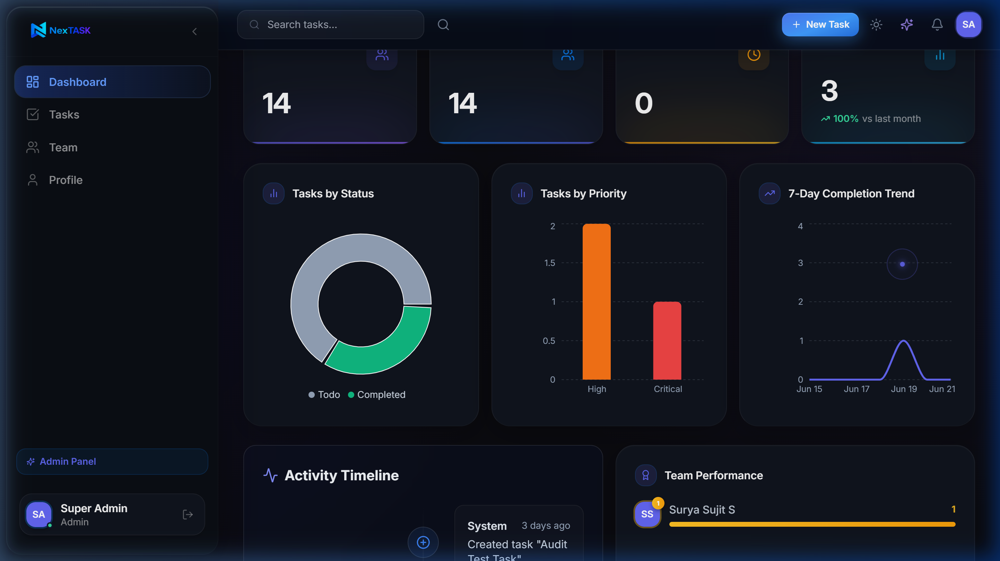
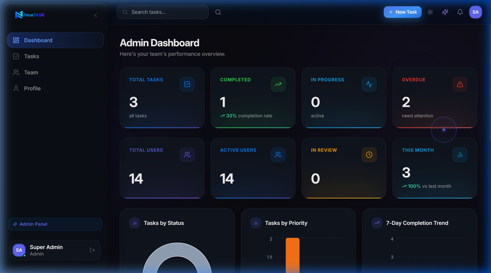
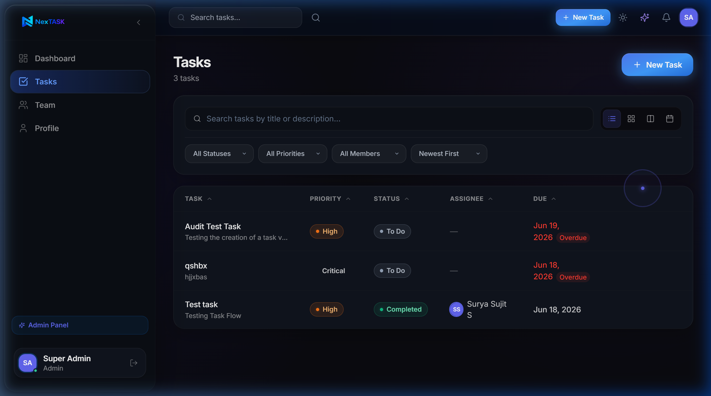
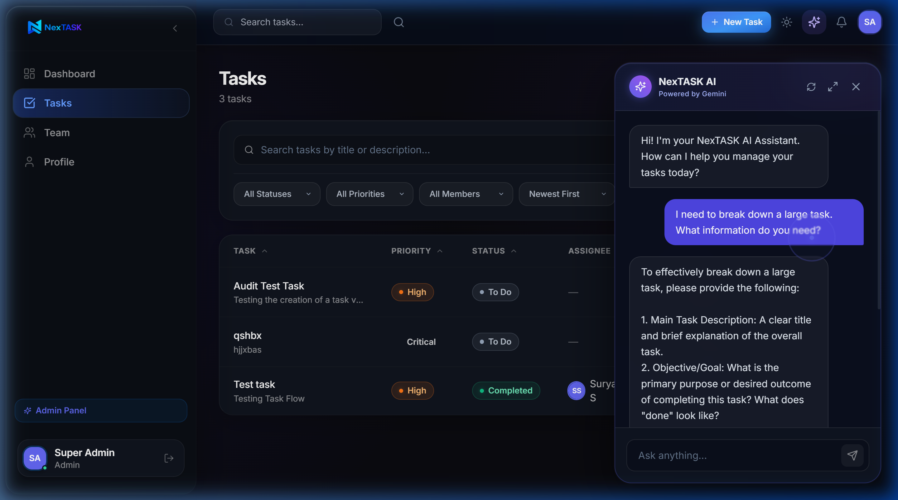
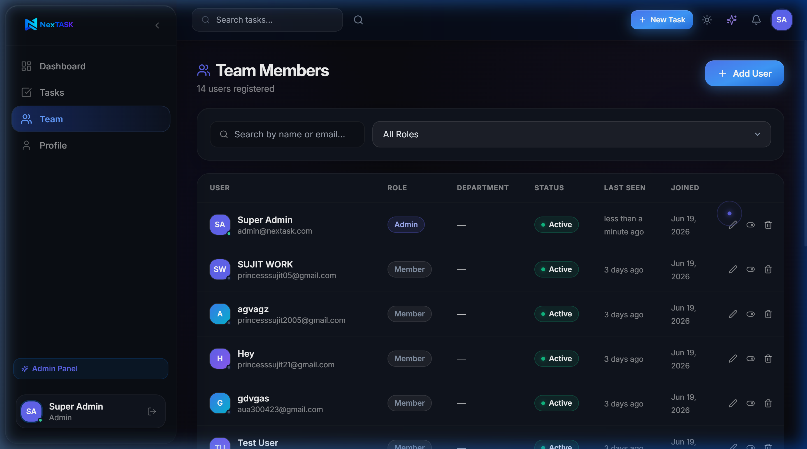
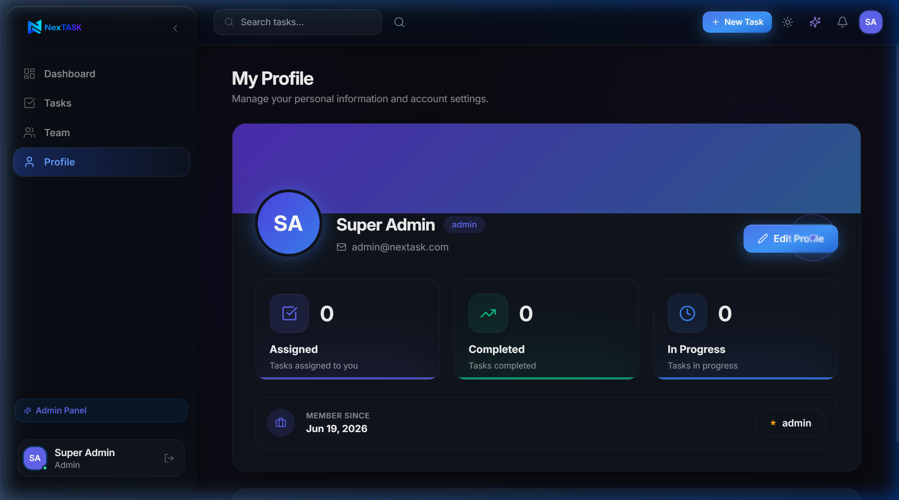

# NexTASK




**NexTASK** is a modern, intelligent task management platform designed to streamline team collaboration, boost productivity, and organize workflows with the power of an integrated AI Assistant. 

### [Live Demo](https://nextask-frontend-kappa.vercel.app) | [GitHub Repository](https://github.com/Sujit-S3/NexTASK)

---

## 🚀 Overview

NexTASK goes beyond traditional to-do lists by offering a comprehensive suite of tools for teams and individuals. With real-time collaboration, intuitive Kanban boards, detailed analytics, and a built-in AI Assistant powered by Google's Gemini, NexTASK ensures your projects stay on track and your team stays aligned.

## ✨ Features

- **Intelligent AI Assistant:** Context-aware AI integrated directly into your workspace to help draft tasks, summarize activity, and brainstorm solutions.
- **Task Management:** Organize tasks with Kanban boards, list views, and calendar integration.
- **Real-Time Collaboration:** Live updates, comments, and online indicators to keep the team synced.
- **Analytics Dashboard:** Visualize team performance, task completion rates, and productivity metrics.
- **Role-Based Access Control:** Secure user management with Admin and Member roles.
- **Responsive Design:** A beautiful, accessible UI that works seamlessly across desktop and mobile devices.
- **Dark Mode Support:** Built-in theme toggling for comfortable viewing in any environment.

---

## 📸 Screenshots

### Dashboard & Analytics


### Task Management (Kanban)


### AI Assistant Integration


### Team & User Management


### User Profile


---

## 🛠 Tech Stack

**Frontend:**
- [React](https://reactjs.org/) (Vite)
- [Tailwind CSS](https://tailwindcss.com/)
- [Redux Toolkit](https://redux-toolkit.js.org/)
- Socket.io-client

**Backend:**
- [Node.js](https://nodejs.org/) & [Express](https://expressjs.com/)
- [MongoDB](https://www.mongodb.com/) & Mongoose
- Socket.io
- Google Gemini API (AI Integration)
- JWT Authentication

**Testing:**
- Jest & Supertest (backend API test suite, `backend/tests/`)
- mongodb-memory-server (in-memory MongoDB, no external DB needed to run tests)

---

## ✅ Testing

The backend has an automated Jest + Supertest suite covering authentication, task CRUD and role permissions, user management, and error handling. It runs against an in-memory MongoDB instance, so no database setup is required.

```bash
cd backend
npm test
```

---

## ⚙️ Installation

To run NexTASK locally, follow these steps:

### Prerequisites
- Node.js (v16+)
- MongoDB (Local or Atlas)

### 1. Clone the repository
```bash
git clone https://github.com/Sujit-S3/NexTASK.git
cd NexTASK
```

### 2. Install dependencies
Install dependencies for both the frontend and backend.

```bash
# Install backend dependencies
cd backend
npm install

# Install frontend dependencies
cd ../frontend
npm install
```

### 3. Set up Environment Variables
Create a `.env` file in both the `backend` and `frontend` directories based on their respective `.env.example` files. See the [Environment Variables](#-environment-variables) section below for details.

### 4. Run the Application
You can use the provided `start.bat` script (on Windows) or run the servers manually.

```bash
# In the backend directory
npm start

# In the frontend directory
npm run dev
```

Navigate to `http://localhost:5173` to view the application.

---

## 🔐 Environment Variables

### Backend (`backend/.env`)
```env
NODE_ENV=development
PORT=5000
MONGODB_URI=your_mongodb_connection_string
JWT_SECRET=your_jwt_secret_key
JWT_EXPIRE=1h
JWT_REFRESH_SECRET=your_jwt_refresh_secret_key
JWT_REFRESH_EXPIRE=30d
CLIENT_URL=http://localhost:5173
RATE_LIMIT_WINDOW_MS=900000
RATE_LIMIT_MAX=100
GEMINI_API_KEY=your_google_gemini_api_key
```

### Frontend (`frontend/.env`)
```env
VITE_API_URL=http://localhost:5000/api
VITE_SOCKET_URL=http://localhost:5000
```

---

## 📜 License

This project is licensed under the MIT License.

---
*Prepared for portfolio presentation and recruiter review.*
